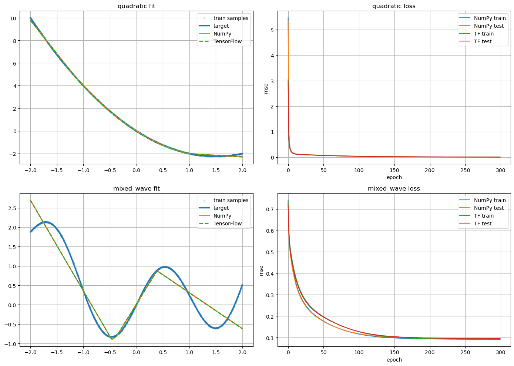

# 实验报告

> - 2352190
> - 於之翔

## 问题定义

理论与实验均表明，带有非线性激活函数的前馈神经网络具有较强的函数逼近能力。本实验选取两个一维目标函数，分别使用 `numpy` 手写反向传播和 `TensorFlow 2.3` 自动求导进行拟合，并在相同训练配置下比较两种实现方式的拟合误差与运行时间。

本实验对应代码文件为：

- `relu_fit_compare.ipynb`

## 理论证明

记 ReLU 激活函数为

$$
\sigma(x)=\max(0,x).
$$

考虑一维输入情况下的两层 ReLU 网络

$$
f(x)=\sum_{i=1}^{m} a_i\,\sigma(w_i x+b_i)+c.
$$

由于每个 ReLU 单元在其断点

$$
x_i=-\frac{b_i}{w_i}\quad (w_i\neq 0)
$$

处将输入空间划分为两段线性区域，因此有限个 ReLU 单元的线性组合仍然是一个连续分段线性函数。也就是说，两层 ReLU 网络天然可以表示一类连续分段线性函数。

另一方面，在紧区间上的任意连续函数都可以被连续分段线性函数一致逼近。更具体地说，设

$$
g\in C([a,b]),
$$

则对任意

$$
\varepsilon > 0,
$$

总存在一个连续分段线性函数

$$
p(x)
$$

使得

$$
\max_{x\in[a,b]} |g(x)-p(x)| < \varepsilon.
$$

又由于任意连续分段线性函数都可以写成有限个 ReLU 单元的线性组合，因此存在一组参数

$$
\{a_i,w_i,b_i,c\}_{i=1}^{m}
$$

使得

$$
\max_{x\in[a,b]} \left|g(x)-\left(\sum_{i=1}^{m} a_i\,\sigma(w_i x+b_i)+c\right)\right|<\varepsilon.
$$

由此可知，两层 ReLU 网络在理论上具有对紧区间上一维连续函数的任意精度逼近能力。

这一理论结论并不意味着在固定宽度、固定训练轮数和有限样本条件下，总能得到非常贴合的拟合结果。实验中最终的拟合精度还受到模型容量、采样密度、优化方法和训练轮数的影响。因此，当目标函数局部变化更复杂时，即使理论上可以逼近，实际训练得到的曲线也可能只较好地贴合整体趋势，而在细节位置保留一定偏差。

## 实验证明

### 函数定义

为了避免实验只对单一函数成立，这里选取两个不同形态的目标函数：

1. 二次函数

$$
f_1(x)=x^2-3x
$$

其代码定义为：

```python
def target_quadratic(x):
    return x ** 2 - 3.0 * x
```

2. 混合波动函数

$$
f_2(x)=\sin(3x)+0.3x^2-0.2x
$$

其代码定义为：

```python
def target_mixed_wave(x):
    return np.sin(3.0 * x) + 0.3 * x ** 2 - 0.2 * x
```

其中，二次函数较为平滑，适合观察模型对简单非线性关系的逼近能力；混合波动函数同时包含振荡项和曲率变化，更适合考察模型对复杂形态函数的拟合表现。

### 数据采集

本实验在区间 `[-2, 2]` 上构造样本点。对每个目标函数，训练集与测试集按如下方式生成：

- 训练集大小：`1024`
- 测试集大小：`512`
- 输入维度：`1`

在实现中，训练集输入使用区间内均匀随机采样，测试集输入使用等间距采样。这样做的目的是：

- 训练集尽量覆盖区间内不同位置，减少样本分布过于规则带来的偶然性；
- 测试集按等间距采样，便于更直观地观察整段区间上的拟合曲线。

相应代码如下：

```python
def make_dataset(func, train_size=1024, test_size=512, interval=(-2.0, 2.0), seed=0):
    rng = np.random.default_rng(seed)
    x_train = rng.uniform(interval[0], interval[1], size=(train_size, 1)).astype(np.float32)
    x_test = np.linspace(interval[0], interval[1], test_size, dtype=np.float32).reshape(-1, 1)
    y_train = func(x_train).astype(np.float32)
    y_test = func(x_test).astype(np.float32)
    return x_train, y_train, x_test, y_test
```

### 模型描述

本实验中，两种实现方式使用完全一致的网络结构，仅梯度计算方式不同：

- 输入/输出维度：`1`
- 隐藏层宽度：`64`
- 激活函数：`ReLU`
- 损失函数：`MSE`
- 优化方法：`SGD`
- 学习率：`0.02`
- 训练轮数：`300`
- 批大小：`128`

网络结构可表示为：

$$
h_1=xW_1+b_1
$$

$$
a_1=\mathrm{ReLU}(h_1)
$$

$$
\hat y=a_1W_2+b_2
$$

其中，`numpy` 版本手动实现前向传播、损失函数、反向传播和参数更新；`TensorFlow` 版本保持相同结构，但使用 `GradientTape` 自动求导并完成参数更新。这样可以在控制变量的前提下，较公平地比较两种实现方式在精度和效率上的差异。

参数初始化采用 xavier 方式，其目的是避免训练初期梯度过大或过小，从而提高训练稳定性。

### 拟合效果

在当前实验配置下，得到如下结果：

```text
target       model           test_rmse    seconds
--------------------------------------------------
quadratic    numpy            0.072763      0.323
quadratic    tensorflow       0.069641      3.434
speed ratio (tf / numpy) = 10.63x
mixed_wave   numpy            0.309016      0.346
mixed_wave   tensorflow       0.308778      3.588
speed ratio (tf / numpy) = 10.38x
```

从结果可以看出：

1. 对于 `quadratic` 函数，两种方法都取得了较小的测试误差，且 `TensorFlow` 略优于 `numpy`。
2. 对于 `mixed_wave` 函数，两种方法的测试误差非常接近，说明在当前网络规模和训练配置下，二者对较复杂函数的逼近能力基本一致。
3. 在运行时间方面，`TensorFlow` 的耗时约为 `numpy` 的 `10` 倍左右。造成这一现象的主要原因是当前任务规模较小、模型结构较浅，`TensorFlow` 自动求导与张量调度的固定开销较明显，因此在小规模 CPU 实验中并不占优势。

本次拟合实验对应的可视化结果已保存为下图：



从图像结果来看，`quadratic` 的拟合较为平滑，预测曲线基本贴近目标函数；而 `mixed_wave` 的拟合难度更高，虽然两种实现都能够较好地跟随整体趋势，但在局部波动位置仍存在一定偏差。其原因在于：两层 ReLU 网络虽然具备通用逼近能力，但在固定隐藏层宽度、固定样本数和有限训练轮数下，网络实际能够形成的分段线性结构仍然有限，因此对局部变化更复杂的目标函数只能做到较好的近似，而不一定在每一处细节都完全重合。

综合来看，本实验较好地验证了两层 ReLU 网络的函数逼近能力，也说明了 `numpy` 与 `TensorFlow` 两种实现方式在最终拟合精度上相差不大，而主要区别更多体现在实现方式与运行效率上。
