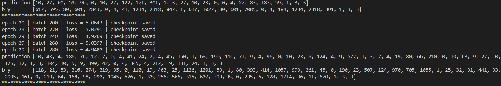
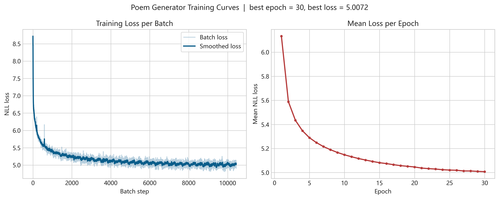
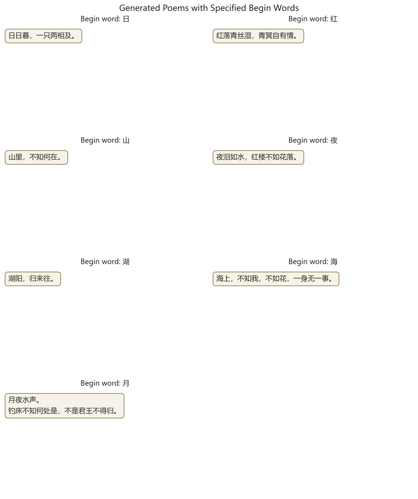
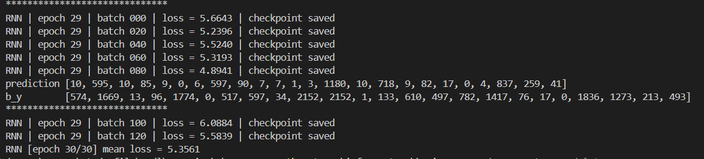
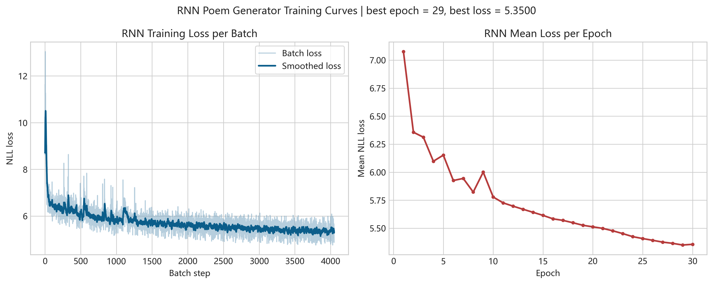
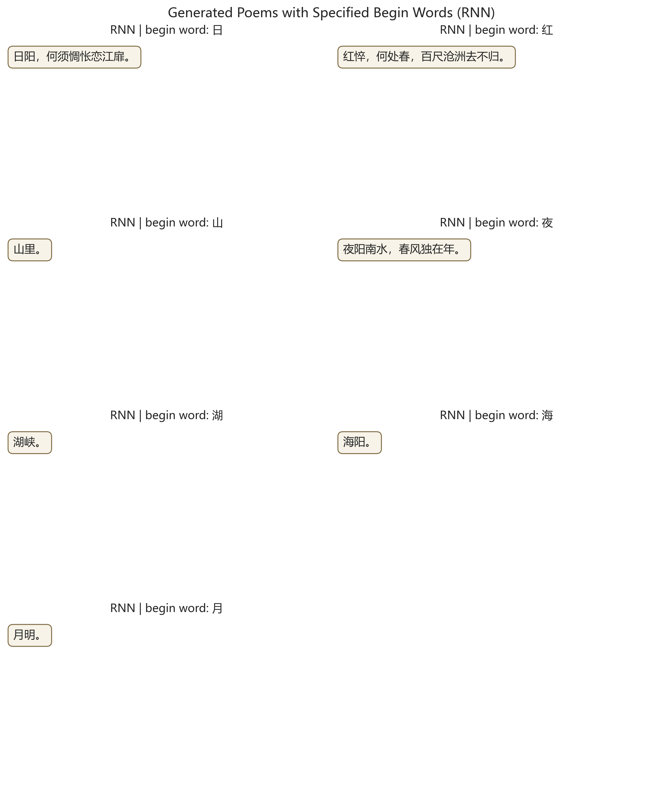

# 实验报告

### 实验内容

本实验围绕唐诗生成任务展开。根据题目要求，我选择完成 `PyTorch` 版本，在 [rnn.py](D:\study_file\nndl\exercise\chap6_RNN\tangshi_for_pytorch\rnn.py) 中补全循环层定义与前向传播中的隐藏状态初始化，并使用 [main.py](D:\study_file\nndl\exercise\chap6_RNN\tangshi_for_pytorch\main.py) 完成模型训练、参数保存和诗歌生成。

在完成题目要求的基础上，我进一步补充了一个对比实验：在相同数据集、相同训练流程和尽量一致的超参数设置下，对比普通 `RNN` 与 `LSTM` 在唐诗生成任务中的表现差异。

本报告包括以下内容：

- `RNN`、`LSTM`、`GRU` 的基本原理
- 唐诗生成的整体流程
- 按题目要求给出的训练截图和指定起始词生成结果
- `RNN` 与 `LSTM` 的对比实验
- 实验总结

### RNN、LSTM、GRU 模型说明

- `RNN`：循环神经网络能够处理序列数据。它在当前时刻的输出不仅依赖当前输入，还依赖前一时刻的隐藏状态，因此适合文本、语音等序列任务。普通 `RNN` 结构简单，但在较长序列上容易出现梯度消失或梯度爆炸，导致长期依赖难以学习。
- `LSTM`：长短期记忆网络是在普通 `RNN` 基础上的改进。它引入细胞状态和门控机制，包括遗忘门、输入门和输出门。遗忘门决定保留多少旧信息，输入门决定写入多少新信息，输出门决定当前隐藏状态如何输出。相比普通 `RNN`，`LSTM` 更适合处理长距离依赖明显的文本生成任务。
- `GRU`：门控循环单元是对 `LSTM` 的简化版本。它保留了门控思想，但将结构简化为更新门和重置门，参数量更少，训练通常更快。在许多任务中，`GRU` 的效果与 `LSTM` 接近。

本实验的主模型使用的是 **双层单向 `LSTM`**，不是 `BiLSTM`。这样设计的原因是唐诗生成属于从左到右逐字预测的任务，模型只应利用前文信息，而 `LSTM` 在这种场景下通常比普通 `RNN` 更稳定。

### 诗歌生成过程

唐诗生成过程主要分为数据预处理、模型训练和诗歌生成三个阶段。

#### 1. 数据预处理

- 训练数据使用 `poems.txt`
- 原始文本按“标题:正文”的形式读取
- 去除空格及含特殊字符的样本
- 过滤长度过短或过长的诗句
- 在每首诗前后加入起始标记 `G` 和结束标记 `E`
- 对所有字符做词频统计，建立字到索引的映射表
- 将每首诗转换为字符索引序列

经过这一步处理后，模型接收的不再是原始汉字，而是对应的整数索引序列。

#### 2. 模型训练

模型结构由三部分组成：

- 词嵌入层 `Embedding`
- 两层循环层 `RNN / LSTM`
- 线性输出层 `Linear`

训练时，输入序列为某首诗的字符索引序列，目标序列为其右移一位后的结果。也就是说，模型学习的是“根据前文预测下一个字”。损失函数采用 `NLLLoss`，优化器采用 `RMSprop`。

#### 3. 诗歌生成

生成阶段首先加载训练好的模型参数，然后给定一个起始字，例如“日”或“月”。模型根据当前序列预测下一个最可能出现的字符，再把这个字符拼接到序列末尾继续输入模型，循环迭代，直到遇到结束标记或达到最大长度。

题目要求的起始词为：

- `日`
- `红`
- `山`
- `夜`
- `湖`
- `海`
- `月`

### 一、题目要求完成情况：LSTM 结果

这一部分对应题目要求中的正式提交结果。模型采用双层 `LSTM`。

#### 1. 训练过程

训练日志截图如下：

训练损失曲线如下：

从日志和曲线可以看出，训练过程中 `loss` 总体呈下降趋势，后期逐渐趋于平稳，没有出现明显的数值异常，说明模型训练过程基本正常。

#### 2. 生成结果

题目要求的 7 个起始词生成结果如下：

对应文本结果为：

- `日`：日日暮，一只两相及。
- `红`：红落青丝湿，青冥自有情。
- `山`：山里，不知何在。
- `夜`：夜泪如水，红楼不如花落。
- `湖`：湖阳，归来往。
- `海`：海上，不知我，不如花，一身无一事。
- `月`：月夜水声。钓床不知何处是，不是君王不得归。

#### 3. 简要分析

可以看到，`LSTM` 已经能够生成带有一定古诗风格的短句，个别句子如“月夜水声”“红落青丝湿”已经具有一定的意象感。但整体上仍存在句子偏短、语义衔接不够自然、常见短语重复较多等问题。这说明模型已经具备基本的生成能力，但距离质量较高、结构完整的唐诗仍有差距。

### 二、补充对比实验：RNN 与 LSTM

为了更清楚地说明普通 `RNN` 与 `LSTM` 在诗歌生成任务上的差异，我在相同数据集、相同训练轮数和相同训练流程下补充训练了一版普通 `RNN`，并将其与 `LSTM` 结果进行对比。

#### 1. 对比设置

- 数据集：`poems.txt`
- 任务：字符级唐诗生成
- 输入方式：根据前文预测下一个字
- 训练轮数：相同
- 优化器：`RMSprop`
- 损失函数：`NLLLoss`
- 对比变量：循环层由 `LSTM` 改为普通 `RNN`

这样设计的目的是尽量控制变量，使两种模型之间的差异主要来源于循环结构本身，而不是训练配置变化。

#### 2. 训练日志对比

  
  

上图左侧为 `LSTM`，右侧为普通 `RNN`。从训练日志可以看到，两者都能够完成训练，但普通 `RNN` 在后期预测上仍更容易与目标序列出现较大偏差。

#### 3. 损失曲线对比

  
  

从损失曲线看，`RNN` 和 `LSTM` 都能够逐步收敛，但 `LSTM` 的收敛过程更平稳，后期损失也更容易保持在较低水平。普通 `RNN` 在长序列任务中更容易受到长期依赖问题影响，因此即使能够收敛，其生成质量通常也不如 `LSTM` 稳定。

#### 4. 生成结果对比

  
  

上图左侧为 `LSTM`，右侧为普通 `RNN`。为了更清楚地说明差异，下面列出一部分文本对比：

| 起始词 | LSTM | RNN |
| --- | --- | --- |
| `日` | 日日暮，一只两相及。 | 日阳，何须惆怅恋江塘。 |
| `红` | 红落青丝湿，青冥自有情。 | 红怅，何处春，百尺沧洲去不归。 |
| `山` | 山里，不知何在。 | 山里。 |
| `夜` | 夜泪如水，红楼不如花落。 | 夜阳南水，春风独在年。 |
| `湖` | 湖阳，归来往。 | 湖岸。 |
| `海` | 海上，不知我，不如花，一身无一事。 | 海阳。 |
| `月` | 月夜水声。钓床不知何处是，不是君王不得归。 | 月明。 |

#### 5. 对比分析

从结果上看，普通 `RNN` 的生成质量整体弱于 `LSTM`，主要体现在：

- 诗句更短，更容易提前收缩成残句，例如“山里。”“湖岸。”“海阳。”
- 长句的语义完整性更差，常常只有局部词语看起来像古诗，但整体逻辑较松散
- 在一些起始词上，`RNN` 只能生成非常短的片段，而 `LSTM` 往往还能维持更长的句子结构

与之相比，`LSTM` 的优势主要体现在：

- 生成句长通常更稳定
- 局部意象和词语搭配更自然
- 长句中上下文保持能力更强
- 虽然仍然会出现重复或语义跳跃，但整体完成度明显高于普通 `RNN`

造成这一差异的根本原因在于：

- 普通 `RNN` 在长序列训练中更容易出现梯度消失，难以保留较远位置的信息
- `LSTM` 通过门控机制显式控制信息的保留与遗忘，因此在文本生成任务中更容易维持上下文一致性

因此，本次补充实验从结果上支持了前面的理论分析：对于唐诗这种具有明显上下文依赖的字符级生成任务，`LSTM` 相比普通 `RNN` 更适合作为主模型。

### 实验总结

本实验完成了题目要求中的 `PyTorch` 版唐诗生成任务，实现了基于双层 `LSTM` 的字符级诗歌生成模型，并成功生成了以 `日、红、山、夜、湖、海、月` 为起始字的诗句。

在此基础上，我又补充完成了普通 `RNN` 的对比实验。实验结果表明：

- `RNN` 与 `LSTM` 都可以用于字符级诗歌生成
- 普通 `RNN` 可以学到一定的字词搭配模式，但生成结果更容易变短、变散
- `LSTM` 由于门控机制的存在，在上下文保持、长句生成和整体稳定性方面明显优于普通 `RNN`

通过本次实验，可以得到以下认识：

- 唐诗生成本质上是一个序列建模问题，即根据前文预测下一个字符
- 普通 `RNN` 结构简单，但在长依赖任务上存在天然短板
- `LSTM` 更适合需要保留上下文信息的文本生成任务
- 即使使用 `LSTM`，当前模型仍然只能生成具有一定古风特征的短句，距离真正语义完整、格律稳定的古诗仍有提升空间

总体而言，本实验既完成了课程要求，也通过补充对比更清楚地说明了 `RNN` 与 `LSTM` 在诗歌生成任务中的差异。后续若希望进一步提升生成质量，可以从增加训练轮数、优化采样策略、扩大模型容量等方向继续改进。

### 参考文献

- Xingxing Zhang and Mirella Lapata. 2014. *Chinese poetry generation with recurrent neural networks*. In Proceedings of EMNLP 2014.
